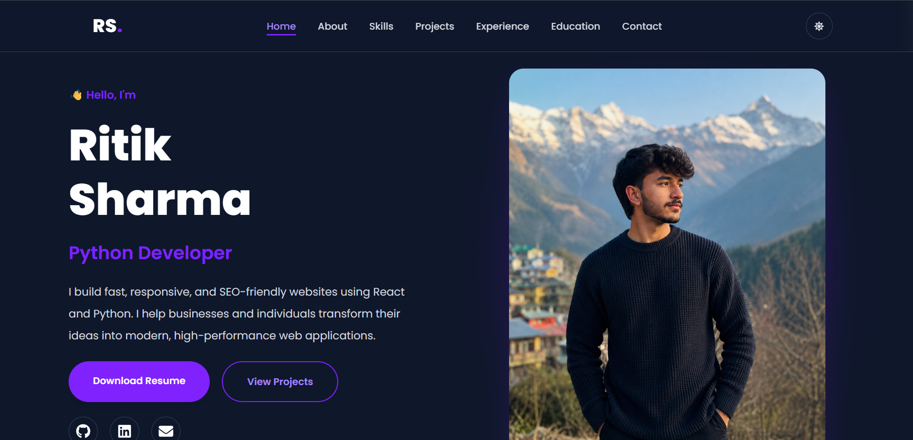
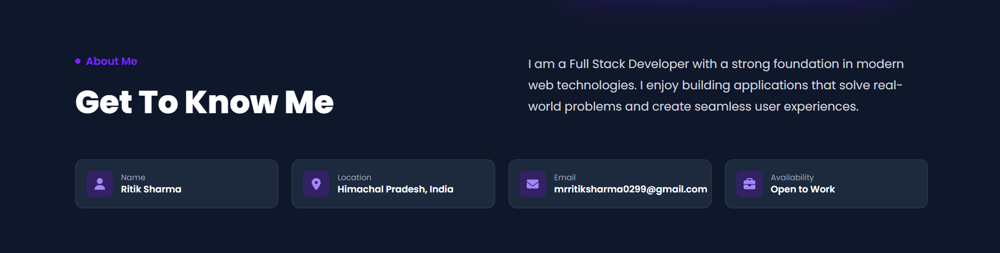
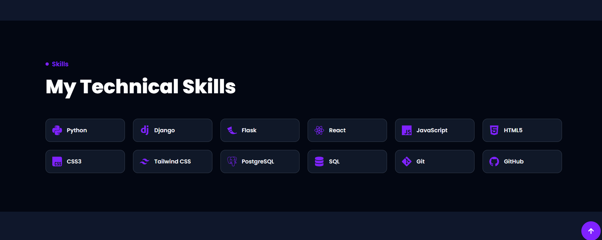
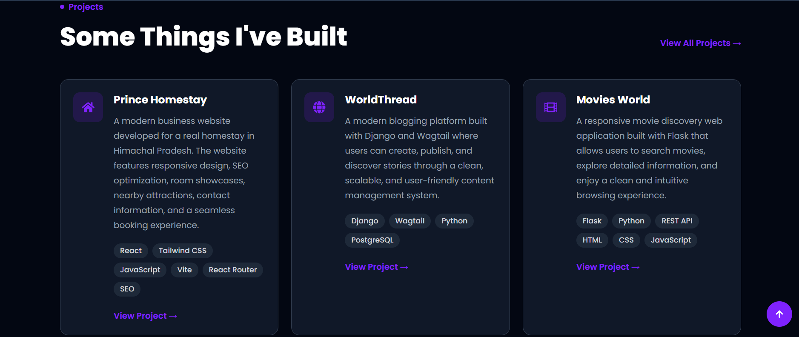
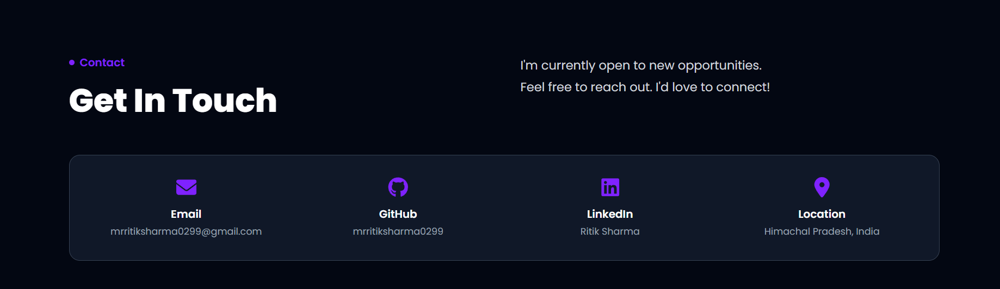
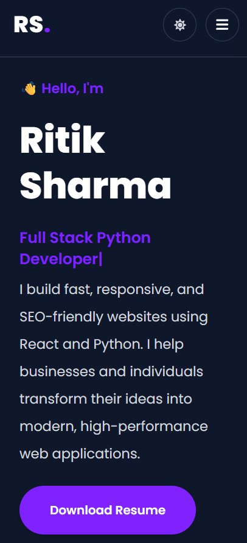

# 🌐 Personal Portfolio

A modern, responsive portfolio website built using React, Vite, and Tailwind CSS. This portfolio showcases my skills, projects, education, and experience as a Full Stack Python Developer.

## 🌍 Live Demo

https://portfolio-beta-indol-3a5zl7dmd6.vercel.app/

---

# ✨ Features

### 👨‍💻 Professional Portfolio

- Modern landing page
- Animated hero section
- Responsive design
- Smooth scrolling
- Clean user interface

### 🙋 About Me

- Personal introduction
- Education
- Career objective
- Developer journey

### 💻 Skills

- Python
- Django
- Flask
- React
- JavaScript
- HTML5
- CSS3
- Tailwind CSS
- Bootstrap
- MySQL
- PostgreSQL
- Git & GitHub
- REST APIs

### 🚀 Projects Showcase

The portfolio includes my major projects:

- 🏡 Prince Homestay Website
- 📝 WorldThread Blog Platform
- 🎬 Movies World (Flask + OMDb API)

Each project contains:

- Live Demo
- GitHub Repository
- Technology Stack
- Project Description

### 📄 Resume

- Resume download button
- Easy recruiter access

### 📱 Responsive Design

- Desktop
- Tablet
- Mobile

---

# 🛠 Tech Stack

## Frontend

- React
- Vite
- JavaScript (ES6+)
- HTML5
- CSS3
- Tailwind CSS

## Libraries

- React Router
- React Icons
- Framer Motion

## Deployment

- Vercel

## Version Control

- Git
- GitHub

---

# 🚀 Installation

Clone the repository

```bash
git clone https://github.com/mrritiksharma0299/portfolio.git
```

Move into the project

```bash
cd portfolio
```

Install dependencies

```bash
npm install
```

Run development server

```bash
npm run dev
```

Build for production

```bash
npm run build
```

---

# 📸 Screenshots

## Home



---

## About



---

## Skills



---

## Projects



---

## Contact



---

## Mobile View



---

# 📂 Project Structure

```
src/
│
├── assets/
├── components/
├── pages/
├── routes/
├── data/
├── App.jsx
├── main.jsx
│
public/
```

---

# 🎯 Purpose

This portfolio is designed to represent my skills, projects, and development journey. It serves as my professional portfolio for recruiters, clients, and anyone interested in my work.

---

# 👨‍💻 Developer

**Ritik Sharma**

Full Stack Python Developer

GitHub:
https://github.com/mrritiksharma0299

Portfolio:
https://your-portfolio-link.vercel.app

---

# 📜 License

This project is developed for learning, portfolio, and professional demonstration purposes.